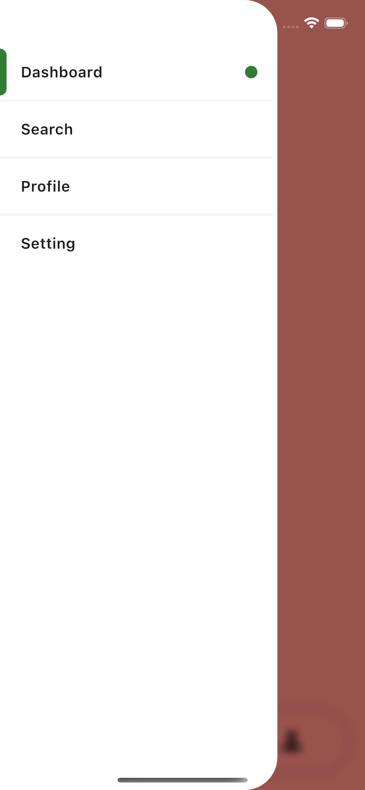
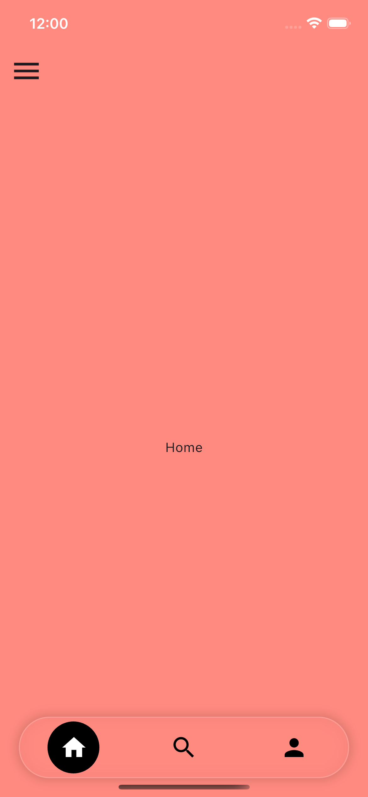
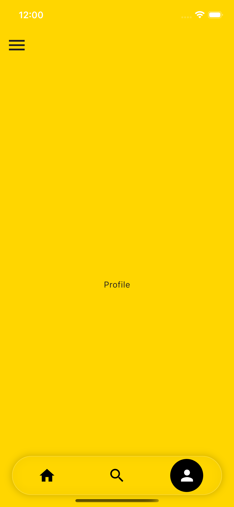

<!--
This README describes the package. If you publish this package to pub.dev,
this README's contents appear on the landing page for your package.

For information about how to write a good package README, see the guide for
[writing package pages](https://dart.dev/tools/pub/writing-package-pages).

For general information about developing packages, see the Dart guide for
[creating packages](https://dart.dev/guides/libraries/create-packages)
and the Flutter guide for
[developing packages and plugins](https://flutter.dev/to/develop-packages).
-->

## Flutter - TabBar with SideMenu
A customizable Flutter UI component that combines a TabBar with a Side Menu. This UI is ideal for integrating both navigation styles in a single app, with smooth animated tab selection.

[](https://flutter.dev)
[](https://dart.dev)


## ✨ Features
- ✨ Custom TabBar and SideMenu with animated selection 
- ✨ Sync between TabBar and Side Menu
- ✨ Smooth transitions and animations 
- ✨ Clean and modular architecture 
- ✨ Easily customizable UI components
- ✨ Easy to use in code

## 📱 UI Overview
- Left side: **Sidebar Menu**
- Top/Body: **TabBar + Tab Views**
- Supports for only mobile. 
- Working on progress for tablet layout.

## 🚀 Getting Started

**1. Add these files to your project**
```
lib/
 └── src/
      ├── custom_main_tabbar_view.dart
      ├── side_drawer_menu_view.dart
      └── main_screen.dart
```

**2. Example**
```
class ExampleApp extends StatefulWidget {
  const ExampleApp({super.key});

  @override
  State<ExampleApp> createState() => _ExampleAppState();
}

class _ExampleAppState extends State<ExampleApp> {
  int index = 0;
  bool isOpenDrawer = false;

  late final pages = [
    DashboardView(tapAction: (value) {
      setState(() => isOpenDrawer = value);
    }),
    SearchView(tapAction: (value) {
      setState(() => isOpenDrawer = value);
    }),
    ProfileView(tapAction: (value) {
      setState(() => isOpenDrawer = value);
    }),
  ];

  final List<IconData> icons = [Icons.home, Icons.search, Icons.person];

  @override
  Widget build(BuildContext context) {
    return MaterialApp(
      debugShowCheckedModeBanner: false,
      home: Scaffold(
        body: Stack(
          children: [
            /// Screens
            pages[index],

            /// Bottom TabBar View
            Positioned(
              bottom: 20, left: 0, right: 0,
              child: CustomMainTabbarView(
                currentIndex: index,
                icons: icons,
                onTap: (i) => setState(() => index = i),
              ),
            ),

            /// SideBar background color
            if (isOpenDrawer)
              Positioned.fill(
                child: BackdropFilter(
                  filter: ImageFilter.blur(sigmaX: 5, sigmaY: 5),
                  child: GestureDetector(
                    onTap: () => { setState(() => isOpenDrawer = false),},
                    child: Container(
                      color: Colors.black.withValues(alpha: 0.4),
                    ),
                  ),
                ),
              ),

            /// SideBar View
            SideDrawerMenuView(
              isOpenDrawer: isOpenDrawer, selectIndex: index,
              onItemTap: (value) {
                setState(() => isOpenDrawer = false);
                switch (value) {
                  case 0: index = 0;
                  case 1: index = 1;
                  case 2: index = 2;
                  case 3:
                    Navigator.push(context, MaterialPageRoute(builder: (_) => Container()));
                }
              },
            ),
          ],
        ),
      ),
    );
  }
}

```

## 🔄 State Synchronization
Both TabBar and Sidebar Menu use the same selectedIndex.

* Clicking Sidebar index → updates TabBar 
* Clicking TabBar index → updates Sidebar
```
int index = 0;
```


## 📸 Screenshots
<p>
  
  
  
 
</p>


## 🔮 Future Improvements
* Add responsive layout (mobile/tablet/desktop)
* Add route-based navigation
* Add theme switching (dark/light mode)

## Github
[](https://github.com/krunal-maisuriya/flutter_tabbar_sidemenu/stargazers)
[](https://github.com/krunal-maisuriya/flutter_tabbar_sidemenu/network)
[](https://github.com/krunal-maisuriya/flutter_tabbar_sidemenu/watchers)
[](https://github.com/krunal-maisuriya/flutter_tabbar_sidemenu/issues)
[](https://github.com/krunal-maisuriya/flutter_tabbar_sidemenu/commits)

## 🤝 Contribution
Feel free to fork and improve this project.

## 📄 License
This project is open-source and free to use.

## 👨‍💻 Author
Developed by **_[Krunal Maisuriya](https://github.com/krunal-maisuriya)_**
